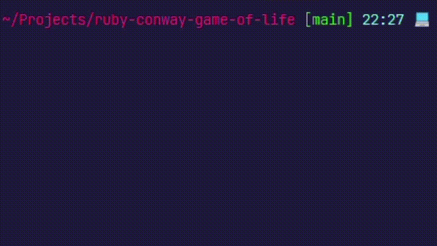

# A Ruby Practice on Conway's Game of Life

It is [Conway's Game of Life](https://en.wikipedia.org/wiki/Conway%27s_Game_of_Life) as a practice of the Ruby Language.  

Simply put, it is a zero-player game, the game progresses by itself once the initial cell placement was set.  

## Installation and Running
clone the repo to local, run `bundle install`  
At root directory, run `ruby './lib/game.rb'`

## Screenshot
